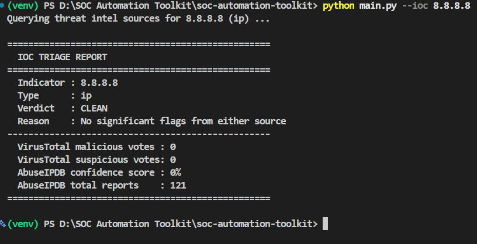
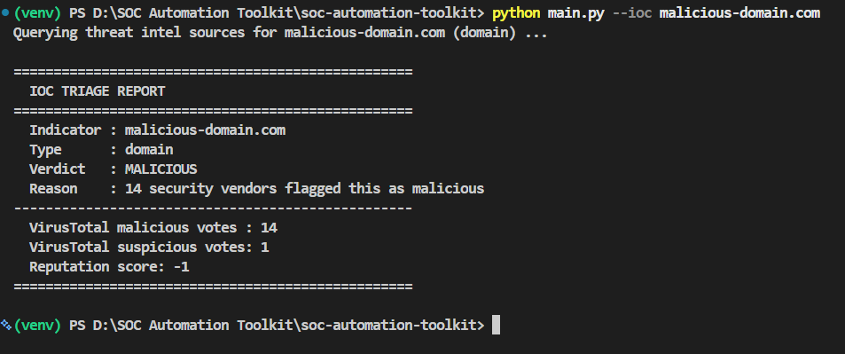
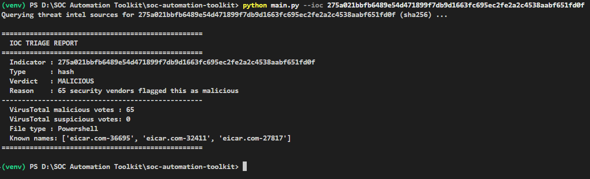

# SOC Automation Toolkit

A Python-based automation toolkit for Tier 1/2 SOC analyst workflows - built to reduce manual threat intel lookup time during alert triage.

## Overview

SOC analysts spend a large portion of their day manually checking IPs, domains, URLs, and file hashes against threat intelligence sources during alert triage and incident investigation. This toolkit automates that lookup-and-score process, mirroring real analyst workflow.

**Current modules:**
1. **IOC Triage Tool** - takes any indicator of compromise (IOC) and returns a clean verdict - MALICIOUS, SUSPICIOUS, or CLEAN - by cross-referencing two independent threat intelligence sources.
2. **Log Parser + Enricher** - parses SSH auth logs, web server access logs, and Windows Security Event Logs to detect brute-force attacks, SQL injection/path traversal attempts, and full attack chains (brute-force → compromise → persistence → privilege escalation), then automatically enriches attacking IPs with the same threat intel clients from Module 1.
3. **Phishing Email Analyzer** - parses .eml files, reads SPF/DKIM/DMARC authentication results, detects social-engineering language and typosquatted sender domains, and enriches extracted URLs/domains using the same VirusTotal client from Module 1.

## Features

- **Automatic IOC type detection** - identifies IP addresses, domains, URLs, and file hashes (MD5/SHA1/SHA256) from raw input using pattern matching
- **Multi-source threat intelligence** - queries both [VirusTotal](https://www.virustotal.com) (70+ antivirus engine consensus) and [AbuseIPDB](https://www.abuseipdb.com) (community abuse reports) for IP addresses
- **Combined verdict scoring** - reconciles disagreements between sources rather than trusting a single feed, catching cases where one source alone would miss a threat
- **Clean CLI reporting** - readable terminal output designed for fast analyst triage, not raw JSON dumps
- **Graceful error handling** - rate limiting, network failures, and malformed input are handled without crashing

## Tech Stack

- **Language:** Python 3
- **APIs:** VirusTotal API v3, AbuseIPDB API v2
- **Libraries:** `requests`, `python-dotenv`, `argparse`

## Installation

```bash
git clone https://github.com/mmanish7634/soc-automation-toolkit.git
cd soc-automation-toolkit
python -m venv venv
source venv/bin/activate   # Windows: venv\Scripts\activate
pip install -r requirements.txt
```

Copy `.env.example` to `.env` and add your own free API keys:
- VirusTotal: https://www.virustotal.com/gui/join-us
- AbuseIPDB: https://www.abuseipdb.com/register

```
VT_API_KEY=your_key_here
ABUSEIPDB_API_KEY=your_key_here
```

## Usage

```bash
# Check an IP address (queries both VirusTotal and AbuseIPDB)
python main.py --ioc 8.8.8.8

# Check a domain
python main.py --ioc example.com

# Check a URL
python main.py --ioc "https://example.com/page"

# Check a file hash (MD5/SHA1/SHA256)
python main.py --ioc 275a021bbfb6489e54d471899f7db9d1663fc695ec2fe2a2c4538aabf651fd0f
```

### Log Analysis Pipelines

```bash
# Analyze SSH auth logs for brute-force attacks
python -m log_enricher.ssh_pipeline --logfile log_enricher/sample_logs/auth.log

# Analyze web server logs for SQLi/path traversal/scanning
python -m log_enricher.web_pipeline --logfile log_enricher/sample_logs/access.log

# Analyze Windows Security Event Logs for attack chains
python -m log_enricher.windows_pipeline --logfile log_enricher/sample_logs/windows_events.csv
```

### Phishing Email Analysis

```bash
python -m phishing_analyzer.phishing_pipeline --eml phishing_analyzer/sample_emails/phishing_sample.eml
```

### Example Output







```
==================================================
  IOC TRIAGE REPORT
==================================================
  Indicator : 275a021bbfb6489e54d471899f7db9d1663fc695ec2fe2a2c4538aabf651fd0f
  Type      : hash
  Verdict   : MALICIOUS
  Reason    : 62 security vendors flagged this as malicious
--------------------------------------------------
  VirusTotal malicious votes : 62
  VirusTotal suspicious votes: 0
  File type : Powershell
  Known names: ['eicar.com-25996', 'eicar.com-21631', 'xekar007.exe']
==================================================
```

## Architecture

```
soc-automation-toolkit/
├── main.py                      # CLI entry point (IOC triage)
├── ioc_triage/
│   ├── ioc_utils.py              # IOC type detection (regex-based)
│   ├── vt_client.py              # VirusTotal API integration (IP/domain/URL/hash)
│   ├── abuseipdb_client.py       # AbuseIPDB API integration
│   └── verdict.py                # Verdict scoring logic
├── log_enricher/
│   ├── ssh_log_parser.py         # SSH auth.log parser
│   ├── brute_force_analyzer.py   # Brute-force detection (pandas)
│   ├── ssh_pipeline.py           # Full SSH analysis pipeline CLI
│   ├── web_log_parser.py         # Apache/Nginx access log parser
│   ├── web_log_analyzer.py       # SQLi/path traversal/scanner detection
│   ├── web_pipeline.py           # Full web log analysis pipeline CLI
│   ├── windows_log_analyzer.py   # Windows Event Log attack chain detection
│   ├── windows_pipeline.py       # Full Windows log analysis pipeline CLI
│   ├── enrich.py                 # Shared enrichment layer (reuses ioc_triage clients)
│   └── sample_logs/              # Sample log files for testing/demo
├── phishing_analyzer/
│   ├── email_parser.py           # .eml parser (headers, auth results, URLs)
│   ├── risk_scorer.py            # Multi-signal phishing risk scoring
│   ├── phishing_pipeline.py      # Full phishing analysis pipeline CLI
│   └── sample_emails/            # Sample phishing/legit .eml files
├── shared/
│   └── config.py                 # Centralized API key loading
├── .env.example                  # Template for API keys (never commit real .env)
└── requirements.txt
```

## Design Decisions

- **Why two threat intel sources instead of one?** No single feed is complete. Testing showed cases where VirusTotal alone reported an IP as clean, but AbuseIPDB flagged it based on recent abuse reports - the combined verdict logic catches these single-source blind spots.
- **Why separate API client files per source?** If an API changes its endpoint structure or response format, only one file needs updating - the rest of the codebase doesn't need to know how the data was fetched.
- **Why explicit status code handling instead of just `response.json()`?** Real-world API calls fail - rate limits, network timeouts, unknown indicators. A tool used in a SOC environment needs to degrade gracefully, not crash.

## Roadmap

- [x] IOC Triage Tool (VirusTotal + AbuseIPDB, all 4 IOC types)
- [x] SSH auth log brute-force detection
- [x] Web server log SQLi/path traversal/scanner detection
- [x] Windows Event Log attack chain detection (brute-force → compromise → persistence → privilege escalation)
- [x] Phishing Email Analyzer (SPF/DKIM/DMARC, urgency detection, typosquatting heuristic, URL enrichment)
- [ ] Batch IOC processing (CSV input/output)
- [ ] Simple web dashboard (Streamlit) tying all three modules together

## Author

Manish - B.Tech Cybersecurity, Lloyd Institute of Engineering & Technology
[GitHub](https://github.com/M-Kay7634/Soc-Automation-Toolkit) | [LinkedIn](https://www.linkedin.com/in/mmanish7634/)